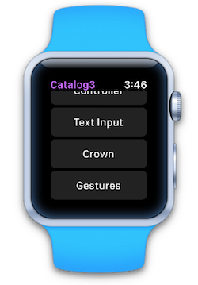

watchOS 3 Catalog: Using WatchKit Interface Elements
==================================================
 
Xamarin watchOS 3 Preview
-------------------------

This sample is for use with the Xamarin watchOS 3 preview that was release along with our [iOS 10 support](https://blog.xamarin.com/let-the-ios10-ing-begin/). 

1. Right-click the **WatchApp3** project and select **Set as startup project**
2. The simulator list should change to display 38mm and 42mm watch options. If it doesn't change, restart Xamarin Studio.
3. With a *watch simulator* selected, start debugging.

 

^ Screenshots are shown with the iOS Simulator running inside [Bezel].
 
### Notes on controls used

Refer to the original [WatchKitCatalog 1.0](https://github.com/xamarin/monotouch-samples/tree/master/WatchKit/WatchKitCatalog) sample for an explanation of the controls used. 

Build/Runtime Requirements 
--------------------------

* Xcode 8.0 (or newer)
* Xamarin Studio 6.10 or newer
* Xamarin.iOS 10
 
Author 
------

Copyright (C) 2015-2016 Xamarin Inc. All rights reserved.  
Ported to Xamarin.iOS by Vincent Dondain.

Other Credits
--------------
*Watch screenshots use [Bezel] courtesy of [infinitapps] :)*  

[Bezel]:http://infinitapps.com/bezel/
[infinitapps]:http://infinitapps.com/
